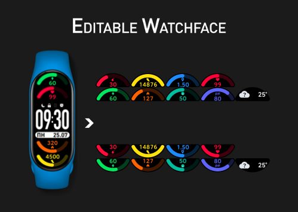

# "ARC" watchface for Xiaomi Mi Band 7

Based on [ARC v2.5 Multilang](https://amazfitwatchfaces.com/mi-band-7/view/16) from [.Kosmik](https://amazfitwatchfaces.com/ucp/234311).

## Tools used

To convert the images (convert to zepp OS tga): <https://watchface-web-editor.vercel.app>.

To install this watchface (sync with band), use [AmazFaces](https://play.google.com/store/apps/details?id=com.amazfitwatchfaces.st) and select `.bin` file.

## Languages

- Czech
- Danish
- Dutch
- English (USA)
- Finnish
- German (Germany)
- Indonesian
- Italian (Italy)
- Japanese (Japan)
- Korean (Korea)
- Malay
- Norwegian
- Polish (Poland)
- Portuguese (Brazil)
- Portuguese (Portugal)
- Romanian
- Russian (Russia)
- Serbian (Latin)
- Simplified Chinese
- Slovakian
- Spanish (Spain)
- Swedish
- Traditional Chinese (Taiwan, China)
- Ukrainian

## Tap zones

- Battery - Flashlight
- Steps - Personal Activity
- Heart Rate - Heart Rate
- Calories - Personal Activity
- PAI - PAI
- Distance - Personal Activity
- Weather - Weather
- SpO2 - Blood Oxygen Level
- Stress - Stress
- Alarm clock icon - Alarm clock
- Left part of the date bar - minus 20% of luminance
- Right part of the date line - plus 20% of luminance

## Contributing

If you spot a bug, or want to improve the code, or even make the content better, you can do the following:

- [Open an issue](https://github.com/cfgnunes/arc-miband7-watchface/issues/new) describing the bug or feature idea;
- Fork the project, make changes, and submit a pull request.
